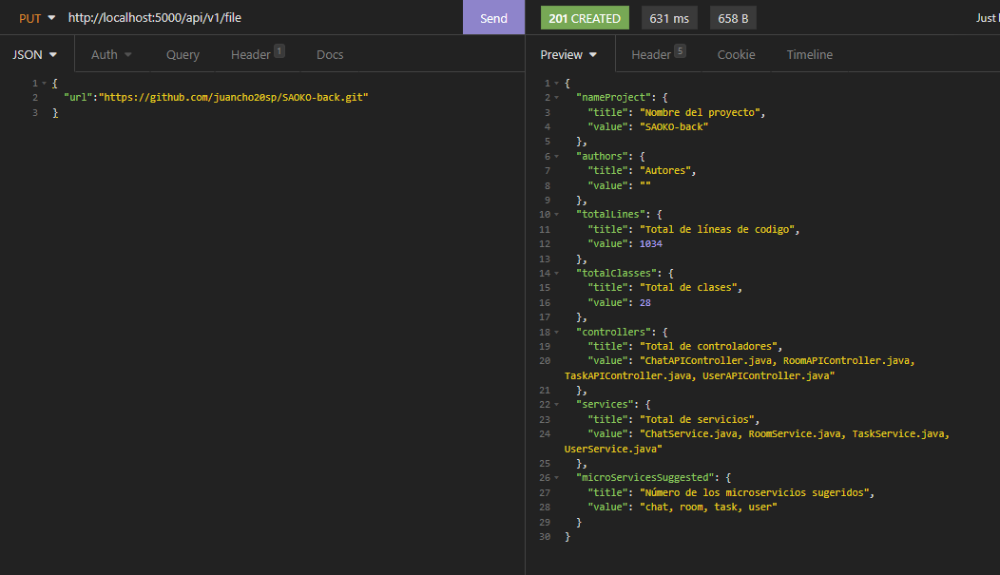
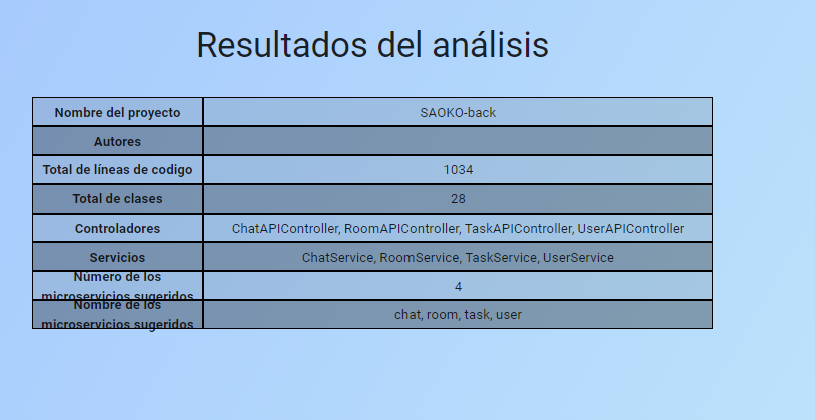
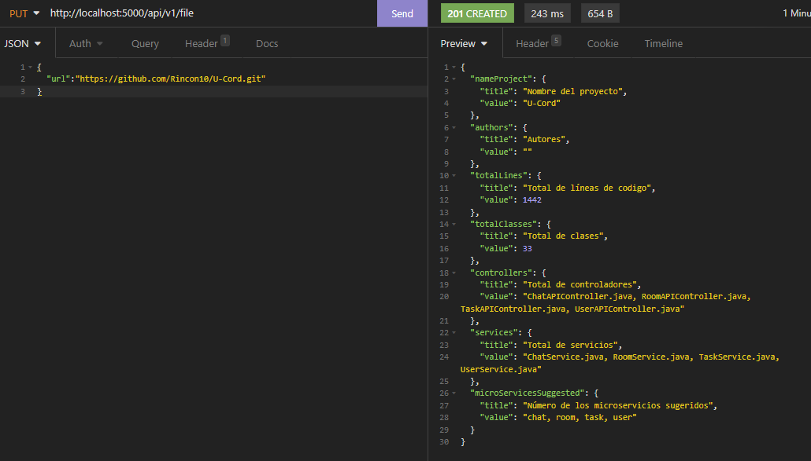

# Backend AREP

## What is this?

This is a repository for all the files used to create a backend with flask in order to connect our functions with a simple JavaScript web application

## Getting Started

For implementing this library you will need to have Python installed in your computer.

### Prerequisites
To use this library you will need to have Python installed in your computer, at least the version 3.7. <br/>
You can check your Python version typing on cmd:

```
python --version
```

### Installing
- Clone this git repository into your computer.
- Start coding!

```
# In your root folder:

https://github.com/Rincon10/AREP-Seminario.git
```

upgrade pip
```
python -m pip install --upgrade pip
```

install virtualenv
```
pip install virtualenv
```

Execute virtualenv
```
virtualenv .
```

### Using the Virtual Environment
**Activate**:
``` python
cd venv/Scripts
activate
```

Deactivate:
``` python
cd venv/Scripts
deactivate
```

Install requirements:
- With the **venv** activated: 

``` python
pip install -r requirements.txt
```

## API
### PUT REQUESTS
- [/api/v1/file]: Here you will find the functionallity based on the FileAnalyzer algorythm. The JSON structure of a PUT request to this endpoint should look like this:
```javascript
{
	"nameProject": {
		"title": "Nombre del proyecto",
		"value": "SAOKO-back"
	},
	"authors": {
		"title": "Autores",
		"value": ""
	},
	"totalLines": {
		"title": "Total de líneas de codigo",
		"value": 1034
	},
	"totalClasses": {
		"title": "Total de clases",
		"value": 28
	},
	"controllers": {
		"title": "Total de controladores",
		"value": "ChatAPIController.java, RoomAPIController.java, TaskAPIController.java, UserAPIController.java"
	},
	"services": {
		"title": "Total de servicios",
		"value": "ChatService.java, RoomService.java, TaskService.java, UserService.java"
	},
	"microServicesSuggested": {
		"title": "Número de los microservicios sugeridos",
		"value": "chat, room, task, user"
	}
}
```

## Testing the enpoint

1. Using 
```js
{
    "url":"https://github.com/juancho20sp/SAOKO-back.git"
}
```

### Back-end Response



### Front-end Response



2. Using the repository
```js
{
    "url":"https://github.com/Rincon10/U-Cord.git"
}
```

### Back-end Response


### Front-end Response



## Built With

* [Python 3.8](https://www.python.org/) - As the main programming language and *Flask* as microframework.


## Author

* **Juan David Murillo** - [Github](https://github.com/juancho20sp) 
* **Iván Camilo Rincón** - [Github](https://github.com/Rincon10) 
* **Leonardo Galeano** - [Github](https://github.com/Ersocaut) 
* **Laura Garcia** - [Github](https://github.com/laura-gar) 


## License

This is an *open source* project.

### Thanks for checking out!
